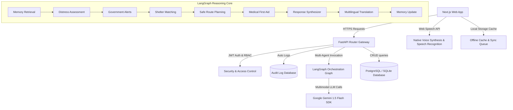

# LifeBridge AI - Intelligent Disaster Response & Emergency Assistant

LifeBridge AI is a production-grade, SaaS-ready disaster coordination and emergency assistance platform. It empowers citizens to report distress scenarios, locate nearby resources, check first-aid guidelines, and view safe transit routes. It also provides rescue authorities with a command dashboard for live incident monitoring, volunteer tracking, and public hazard alerts.

---

## 🏛️ Platform Architecture



---

## 🚀 Key Production Features

1. **LangGraph Multi-Agent Core**: Coordinates 7 specialized agents (Memory, Assessment, Alerts, Shelters, Safe Routes, First Aid, and Translation) to compile precise, safe, and action-oriented rescue directions.
2. **Threat Lens Vision (Multimodal AI)**: Allows uploading disaster snapshots (flooding, fires, damaged walls, roadblocks, injuries) for instant hazard identification using Gemini’s vision capabilities.
3. **Live Rescue Map Console**: A high-performance vector map rendering animated flood/fire zones, road roadblocks, volunteer positions, shelters, and hospital clinics with interactive overlays and coordinate reporting.
4. **Instant SOS Distress Beacon**: Fullscreen siren countdown with GPS capture, dispatcher routing, automated emergency contact alerting, and voice synthesis confirmations.
5. **Hands-free Voice Companion**: Dual Speech-to-Text and Text-to-Speech loops supporting voice-activated distress reporting across English, Hindi, Kannada, Tamil, Telugu, and Marathi.
6. **Offline-First Caching**: Automatically saves resource metrics local storage. Holds offline SOS dispatches in a sync queue and pushes them to database servers once network connectivity is restored.
7. **Audit Logging & RBAC Security**: Generates automated terminal audit logs for all security incidents. Restricts analytics metrics and broadcast alerts to verified administrators.

---

## 🛠️ Installation & Local Setup

### Prerequisite: Environment Variables
Create a `.env` file in the root directory (based on `.env.example`):
```env
GEMINI_API_KEY=your_google_gemini_api_key_here
DATABASE_URL=sqlite:///./lifebridge.db
SECRET_KEY=super-secret-key-change-in-production
```

### 1. One-Click Docker Compose Build (Recommended)
Start the complete production stack (Database, Adminer UI, Backend API, Frontend Web):
```bash
docker-compose up --build -d
```
- Frontend Web: `http://localhost:3000`
- FastAPI Docs: `http://localhost:8000/docs`
- DB Adminer Panel: `http://localhost:8080`

### 2. Manual Local Installation

#### Backend Setup
```bash
cd backend
python -m venv venv
source venv/Scripts/activate # On Windows: venv\Scripts\activate
pip install -r requirements.txt
pip install pytest httpx
python -m uvicorn app.main:app --reload --port 8000
```

#### Frontend Setup
```bash
cd frontend
npm install
npm run dev
```
Navigate to `http://localhost:3000` to interact with the platform.

---

## 🧪 Running Verification Tests

We maintain an isolated Pytest suite validating authentication security, Role-Based Access Control, CRUD operations, audit logs, and LangGraph state variables:

```bash
cd backend
python -m pytest
```

---

## 🔒 REST API Reference Map

| Route | Method | Access | Details |
|---|---|---|---|
| `/api/auth/register` | `POST` | Public | Register new citizens or responders |
| `/api/auth/login/json` | `POST` | Public | Secure JSON authentication returning JWT |
| `/api/auth/me` | `GET` | User | Retrieve current user profile details |
| `/api/requests/` | `POST` | User | Submit critical emergency request (SOS) |
| `/api/ai/chat` | `POST` | User | Execute LangGraph Multi-Agent Copilot flow |
| `/api/ai/analyze-image` | `POST` | User | Analyze disaster scene photographs |
| `/api/admin/stats` | `GET` | Admin | Fetch operations analytics metrics |
| `/api/admin/audit-logs` | `GET` | Admin | Fetch system audit logging stream |
