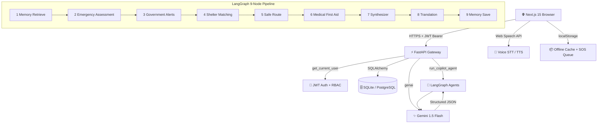
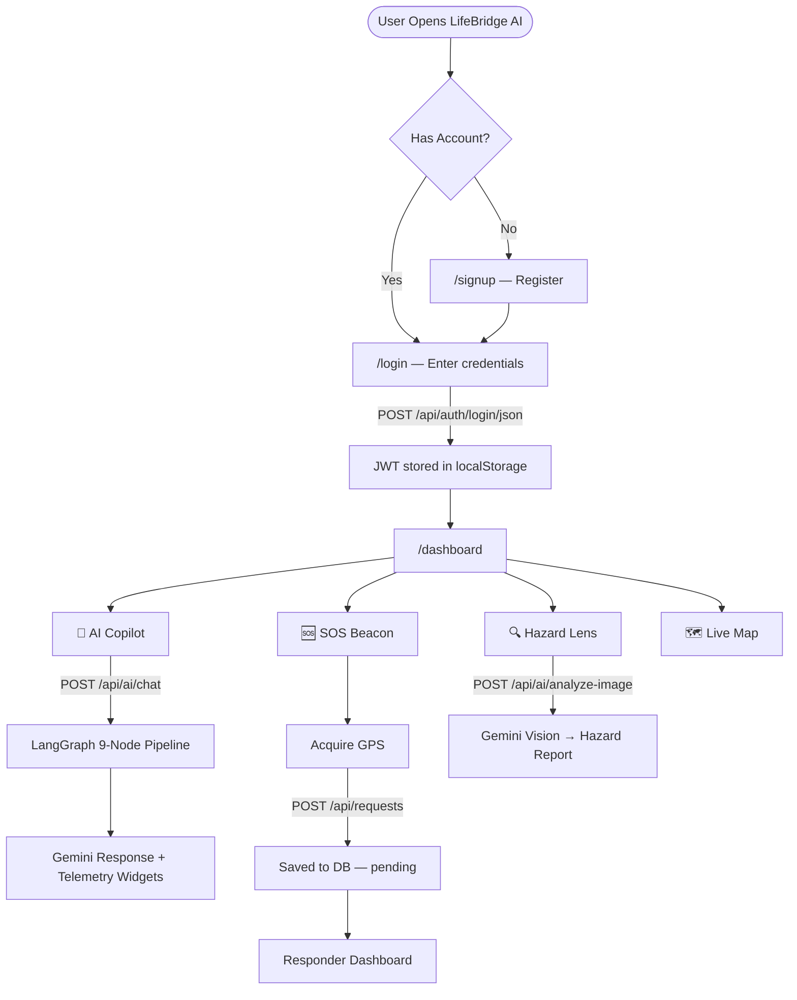
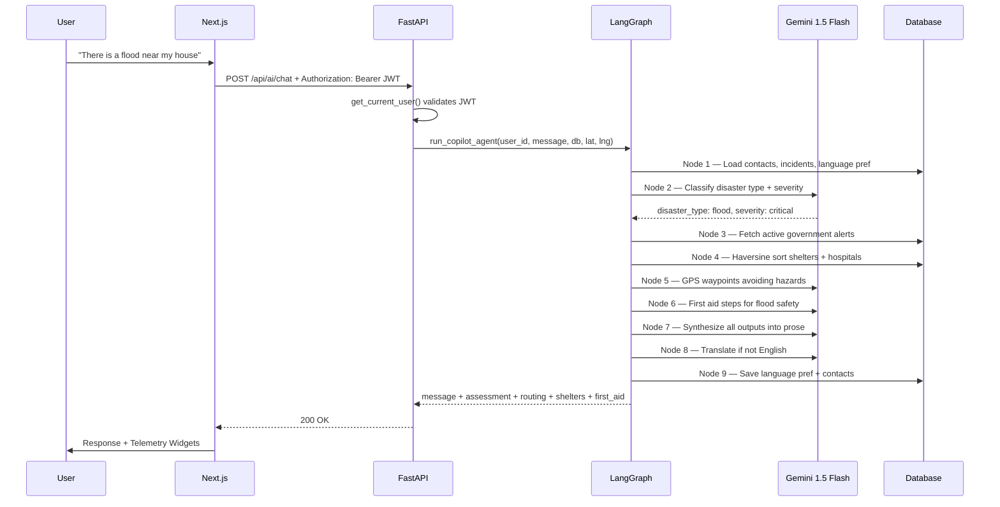
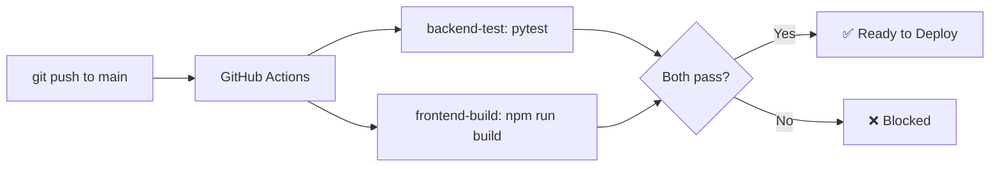

<div align="center">

<h1>🛡️ LifeBridge AI</h1>
<h3>Intelligent Disaster Response & Emergency Assistant Platform</h3>

[](https://github.com/sharada0719/LifeBridge-AI/actions/workflows/ci-cd.yml)
[](https://python.org)
[](https://fastapi.tiangolo.com)
[](https://nextjs.org)
[](https://langchain-ai.github.io/langgraph/)
[](https://ai.google.dev)
[](https://docker.com)
[](LICENSE)

<br/>


**A production-grade, AI-powered emergency coordination platform — powered by Google Gemini 1.5 Flash and a LangGraph 9-node multi-agent reasoning core.**

[🌐 Live Demo](https://friendly-beauty-production.up.railway.app) · [📖 API Docs](https://friendly-beauty-production.up.railway.app/docs) · [🐛 Report Bug](https://github.com/sharada0719/LifeBridge-AI/issues)

</div>

---
## 📋 Table of Contents

- [Problem Statement](#-problem-statement)
- [Solution](#-solution)
- [Key Features](#-key-features)
- [Screenshots](#-screenshots)
- [System Architecture](#-system-architecture)
- [Application Workflow](#-application-workflow)
- [AI Multi-Agent Workflow](#-ai-multi-agent-workflow)
- [Gemini Integration](#-gemini-integration)
- [Modules](#-modules)
- [Tech Stack](#-tech-stack)
- [Backend Architecture](#-backend-architecture)
- [Frontend Architecture](#-frontend-architecture)
- [Database Structure](#-database-structure)
- [API Reference](#-api-reference)
- [Folder Structure](#-folder-structure)
- [Installation Guide](#-installation-guide)
- [Railway Deployment](#-railway-deployment)
- [Google Cloud Run Deployment](#-google-cloud-run-deployment)
- [CI/CD Pipeline](#-cicd-pipeline)
- [Future Enhancements](#-future-enhancements)
- [Author](#-author)
- [License](#-license)

---

## 🚨 Problem Statement

During natural disasters — floods, earthquakes, fires, cyclones — the gap between **citizens in distress** and **rescue authorities** costs lives:

| Problem | Impact |
|---|---|
| Citizens don't know what immediate action to take | Preventable injuries and deaths |
| Responders lack real-time locations of all distress calls | Delayed or missed rescues |
| No unified view of shelters, hospitals, and supplies | Inefficient resource allocation |
| Visual hazard assessment requires trained personnel on-site | Slow threat identification |
| Language barriers prevent timely communication | Critical information lost |
| Systems fail when internet connectivity drops | Delayed SOS transmission |

---

## 💡 Solution

LifeBridge AI solves all of the above in one integrated platform:

- **AI Copilot** — A 9-node LangGraph agent analyzes distress messages and returns first-aid guidance, safe routes, matched shelters, and government alerts in real time.
- **Hazard Lens** — Upload any disaster photo; Gemini Vision instantly classifies fires, floods, structural damage, roadblocks, and injuries.
- **SOS Beacon** — One tap, 5-second countdown, GPS capture, distress signal routed to rescue dispatchers and logged permanently.
- **Live Rescue Map** — Real-time map of all active shelters, hospitals, volunteers, and hazard zones.
- **Offline-First** — Every critical feature falls back to localStorage with an offline queue that auto-syncs on reconnection.
- **Multilingual** — Responses in English, Hindi, Kannada, Tamil, Telugu, and Marathi.

---
## ✨ Key Features

| # | Feature | Description |
|---|---|---|
| 1 | 🤖 **AI Emergency Copilot** | LangGraph 9-node pipeline: Memory → Assessment → Alerts → Shelters → Route → First Aid → Synthesis → Translation → Save |
| 2 | 🔍 **Hazard Lens** | Upload disaster photos for Gemini Vision analysis — detects floods, fires, damage, roadblocks, injuries |
| 3 | 🆘 **SOS Distress Beacon** | Fullscreen countdown, GPS capture, dispatcher routing, voice confirmation, offline queue |
| 4 | 🗺️ **Live Rescue Map** | Animated hazard zones, shelter/hospital pins, volunteer positions, safe route overlays |
| 5 | 🎤 **Voice Companion** | Hands-free Speech-to-Text + Text-to-Speech in 6 Indian languages |
| 6 | 📴 **Offline-First** | localStorage fallback + background SOS sync queue on reconnect |
| 7 | 🏥 **Resource Dashboard** | Real-time shelters, hospitals, volunteers, supply inventory tracking |
| 8 | 🔐 **RBAC Security** | JWT auth with Citizen / Responder / Admin role separation |
| 9 | 📊 **Admin Analytics** | Incident charts, resource utilization rates, full audit log stream |
| 10 | 🌐 **Multilingual** | English, Hindi, Kannada, Tamil, Telugu, Marathi |

---

## 📸 Screenshots

> Add your actual screenshots to `docs/images/` — they will render automatically below.

### Landing & Auth
| Login | Sign Up |
|---|---|
|  |  |

### Dashboard


### AI Emergency Copilot


### Hazard Lens Image Analyzer


### Live Rescue Map


### SOS Distress System


### Shelters & Hospitals
| Shelters | Hospitals |
|---|---|
|  |  |

### Volunteers & Resources
| Volunteers | Resources |
|---|---|
|  |  |

### Admin Dashboard


---
## 🏛️ System Architecture




---

## 🔄 Application Workflow




---

## 🤖 AI Multi-Agent Workflow




| Node | Agent | What It Does |
|---|---|---|
| 1 | Memory Retrieve | Loads past incidents, contacts, language preference |
| 2 | Emergency Assessment | Classifies disaster type, severity, injuries |
| 3 | Government Alerts | Fetches and synthesizes active DB alerts |
| 4 | Shelter Matching | Haversine distance sort of live shelters + hospitals |
| 5 | Safe Route | GPS waypoints avoiding known hazard zones |
| 6 | Medical First Aid | Steps for burns, CPR, bleeding, fractures, snakebites |
| 7 | Response Synthesizer | Combines all outputs into one Gemini response |
| 8 | Translation | Translates to Hindi / Kannada / Tamil / Telugu / Marathi |
| 9 | Memory Save | Persists language preference and detected user data |

---

## ✨ Gemini Integration

LifeBridge AI uses **Gemini 1.5 Flash** in three modes:

**Structured JSON — Agent Nodes 2–6, 8**
```python
model = genai.GenerativeModel("gemini-1.5-flash", system_instruction=PROMPT)
response = model.generate_content(prompt,
    generation_config={"response_mime_type": "application/json",
                       "response_schema": PydanticSchema})
```

**Free-text Synthesis — Node 7**
```python
model = genai.GenerativeModel("gemini-1.5-flash", system_instruction=PROMPT)
response = model.generate_content(prompt)
```

**Multimodal Vision — Hazard Lens**
```python
model = genai.GenerativeModel("gemini-1.5-flash")
response = model.generate_content(
    [prompt, {"mime_type": "image/jpeg", "data": image_bytes}],
    generation_config={"response_mime_type": "application/json",
                       "response_schema": ImageAnalysisResponse})
```

> All three paths have heuristic fallbacks — if `GEMINI_API_KEY` is absent the app returns pre-built structured responses and stays fully functional.

---

## 📦 Modules

<details>
<summary><b>🔐 Authentication</b></summary>

Register with name, email, password, and role (`citizen` / `responder` / `admin`). Passwords are hashed with bcrypt. Login returns an HS256 JWT valid for 24 hours. Every protected route uses `Depends(get_current_user)` which decodes the token and returns the active user. The frontend stores the token in `localStorage["lb_token"]` and sends `Authorization: Bearer <token>` on every call.
</details>

<details>
<summary><b>🤖 AI Emergency Copilot</b></summary>

`POST /api/ai/chat` — accepts `{message, latitude, longitude, preferred_language}`. Runs the full LangGraph 9-node pipeline and returns structured metadata so the frontend can render telemetry widgets: Emergency Assessment card, Active Alerts banner, Shelter Recommendations, GPS Route Steps, and First Aid Guide. Handles greetings naturally. Voice input via Web Speech API; playback via SpeechSynthesis in 6 languages.
</details>

<details>
<summary><b>🔍 Hazard Lens Image Analysis</b></summary>

`POST /api/ai/analyze-image` — accepts `multipart/form-data` image (JPG / PNG / WEBP). Sends raw bytes to Gemini Vision with a strict Pydantic schema. Detects `floods_detected`, `fire_detected`, `damage_detected`, `roadblock_detected`, `injuries_detected`. Returns `hazard_summary`, `estimated_severity`, `suggested_safety_actions`. Filename-based heuristic fallback when API key is unavailable.
</details>

<details>
<summary><b>🆘 SOS Distress System</b></summary>

Floating SOS button on every dashboard page. 5-second countdown with voice announcement. GPS via `navigator.geolocation`. `POST /api/requests` with JWT — persisted as `status: pending`. Broadcast notification sent automatically to all responders. Offline: queued in `localStorage["lb_offline_requests"]`, replayed on reconnect.
</details>

<details>
<summary><b>🗺️ Live Rescue Map</b></summary>

Interactive canvas map with animated flood, fire, and cyclone overlays. Pins for each shelter, hospital, and volunteer with live data popups. Safe route visualization from user location to nearest shelter. Coordinate reporting — drop a pin to mark a new hazard.
</details>

<details>
<summary><b>🏠 Shelters · 🏥 Hospitals · 🙋 Volunteers · 📦 Resources</b></summary>

**Shelters** — name, GPS, capacity, occupancy, contact. Responders update occupancy live. AI Copilot sorts by Haversine distance.

**Hospitals** — name, address, GPS, total beds, available beds. Bed utilization shown as colored indicator.

**Volunteers** — skill set (First Aid, Water Rescue, Medical, Driving), status `active`/`inactive`, live GPS. Visible on the rescue map.

**Resources** — water, food, medical_kit, blanket, power_bank, life_jacket. Status `available`/`allocated`/`depleted`. GPS depot locations.
</details>

<details>
<summary><b>👥 Emergency Contacts · 🔔 Notifications</b></summary>

**Emergency Contacts** — per-user trusted contacts displayed in the SOS overlay and loaded by the AI Copilot Memory agent.

**Notifications** — `alert` (government warnings), `info`, `system`. Admins broadcast to all users. Unread badge count in sidebar.
</details>

---

## 🛠️ Tech Stack

### Backend
| Technology | Version | Purpose |
|---|---|---|
| Python | 3.10 | Core language |
| FastAPI | 0.110+ | REST API + async |
| SQLAlchemy | 2.0+ | ORM |
| LangGraph | 0.1+ | Multi-agent state machine |
| Google Generative AI | 0.8+ | Gemini 1.5 Flash SDK |
| python-jose | 3.3+ | JWT |
| passlib + bcrypt | 1.7+ | Password hashing |
| Pydantic v2 | 2.6+ | Schema validation |
| Uvicorn | 0.28+ | ASGI server |

### Frontend
| Technology | Version | Purpose |
|---|---|---|
| Next.js | 15 App Router | React framework |
| TypeScript | 5+ | Type-safe client |
| Tailwind CSS | 3.4+ | Styling |
| Framer Motion | 11+ | Animations |
| Lucide React | 0.46+ | Icons |
| Web Speech API | Native | Voice I/O |

### Infrastructure
| Technology | Purpose |
|---|---|
| Docker + Compose | Local full-stack deployment |
| GitHub Actions | CI/CD on every push |
| Railway | Primary production deployment |
| Google Cloud Run | Serverless GCP deployment |
| Google Secret Manager | Secure secret storage |

---

## 🔧 Backend Architecture

```
backend/app/
├── main.py              ← FastAPI app, CORS, routers, startup seed
├── config.py            ← Pydantic Settings
├── database.py          ← SQLAlchemy engine + session
├── models.py            ← ORM models (9 tables)
├── schemas.py           ← Pydantic v2 schemas
├── crud.py              ← DB read/write helpers
├── auth.py              ← JWT + bcrypt
├── routers/             ← One file per resource
├── agents/              ← LangGraph 9-node system
├── prompts/             ← Gemini system instructions
└── tools/               ← DB + memory helpers for agents
```

## 🎨 Frontend Architecture

```
frontend/
├── app/
│   ├── login/ signup/   ← Auth pages
│   └── dashboard/       ← 11 dashboard sub-pages
├── components/          ← Sidebar, ThemeProvider
└── lib/api.ts           ← Typed API client + offline fallback
```

---

## 🗄️ Database Structure

```mermaid
erDiagram
    User ||--o{ EmergencyContact : has
    User ||--o{ EmergencyRequest : submits
    User ||--o| Volunteer : registers_as
    User ||--o{ Notification : receives
    User ||--o{ AuditLog : generates
    User { string id; string email; string role; string password_hash }
    EmergencyRequest { string id; string emergency_type; string status; string severity; float latitude; float longitude }
    Shelter { string id; string name; int capacity; int current_occupancy }
    Hospital { string id; string name; int total_beds; int available_beds }
    Volunteer { string id; string skill_set; string status }
    Resource { string id; string type; int quantity; string status }
    Notification { string id; string type; bool is_read }
    AuditLog { string id; string action; string details }
```

---

## 📡 API Reference

| Method | Endpoint | Auth | Description |
|---|---|---|---|
| POST | `/api/auth/register` | Public | Register new account |
| POST | `/api/auth/login/json` | Public | Login — returns JWT |
| GET | `/api/auth/me` | Bearer | Current user profile |
| PUT | `/api/users/me` | Bearer | Update profile |
| GET/POST | `/api/users/me/contacts` | Bearer | Emergency contacts |
| POST | `/api/requests` | Bearer | Submit SOS request |
| GET | `/api/requests` | Bearer | All requests (Responder/Admin) |
| GET | `/api/requests/me` | Bearer | Own requests |
| PATCH | `/api/requests/{id}` | Responder | Update status |
| POST | `/api/ai/chat` | Bearer | Run AI Copilot |
| POST | `/api/ai/analyze-image` | Bearer | Hazard Lens vision |
| GET/POST | `/api/shelters` | Bearer | Shelters CRUD |
| GET/POST | `/api/hospitals` | Bearer | Hospitals CRUD |
| GET/POST | `/api/volunteers` | Bearer | Volunteers CRUD |
| GET/POST | `/api/resources` | Bearer | Resources CRUD |
| GET | `/api/notifications` | Bearer | Get notifications |
| POST | `/api/notifications/broadcast` | Admin | Broadcast alert |
| GET | `/api/admin/stats` | Admin | Analytics data |
| GET | `/api/admin/audit-logs` | Admin | Audit log stream |

---

## 📁 Folder Structure

```
LifeBridge-AI/
├── .github/workflows/ci-cd.yml
├── backend/
│   ├── app/agents/ prompts/ routers/ tools/ tests/
│   ├── Dockerfile
│   └── requirements.txt
├── frontend/
│   ├── app/dashboard/   (11 pages)
│   ├── components/
│   ├── lib/api.ts
│   └── Dockerfile
├── docs/images/          ← Screenshots + diagrams
├── cloudbuild.yaml        ← GCP Cloud Build pipeline
├── deploy.ps1             ← One-command GCP deploy
├── docker-compose.yml
├── .env.example
└── README.md
```

---

## ⚡ Installation Guide

```bash
# 1. Clone
git clone https://github.com/sharada0719/LifeBridge-AI.git
cd LifeBridge-AI

# 2. Set env vars
cp .env.example .env
# Edit .env — add GEMINI_API_KEY, DATABASE_URL, SECRET_KEY

# 3a. Docker (recommended)
docker-compose up --build -d
# Frontend: http://localhost:3000  |  API: http://localhost:8000/docs

# 3b. Manual — backend
cd backend && python -m venv venv && venv\Scripts\activate
pip install -r requirements.txt
python -m uvicorn app.main:app --reload --port 8000

# 3b. Manual — frontend (new terminal)
cd frontend && npm install && npm run dev

# Tests
cd backend && python -m pytest -v
```

---

## 🚂 Railway Deployment

1. Create account at [railway.app](https://railway.app)
2. **New Project → Deploy from GitHub** → `sharada0719/LifeBridge-AI`
3. Add a **PostgreSQL** plugin
4. Set env vars: `GEMINI_API_KEY`, `DATABASE_URL` (auto-filled), `SECRET_KEY`
5. Railway auto-detects the Dockerfile and deploys both services

---

## ☁️ Google Cloud Run Deployment

**Project:** `woven-sequence-500506-p6` | **Region:** `us-central1`

```powershell
# One-command automated deploy (PowerShell)
.\deploy.ps1
```

Or manually:
```powershell
gcloud auth login
gcloud config set project woven-sequence-500506-p6
gcloud services enable run.googleapis.com cloudbuild.googleapis.com containerregistry.googleapis.com secretmanager.googleapis.com
# Store secrets, build images, push, deploy — see deploy.ps1 for full steps
```

---

## ⚙️ CI/CD Pipeline



Pipeline: `.github/workflows/ci-cd.yml` — runs on every push and PR to `main`.

---

## 🔮 Future Enhancements

| Enhancement | Description |
|---|---|
| 📡 WebSocket real-time updates | Push live SOS status without polling |
| 🛰️ Satellite imagery | Flood extent maps from Google Earth Engine |
| 📱 React Native mobile app | iOS + Android with push notifications |
| 🔗 Government API integration | Live alerts from NDMA / IMD |
| 🤝 Volunteer matching | Auto-match by proximity and skill set |
| 🔒 Two-factor authentication | OTP via SMS for responder accounts |
| 📊 Predictive analytics | ML model for disaster hotspot prediction |
| 🔔 SMS / push notifications | Twilio SMS + Firebase FCM |

---

## 👩‍💻 Author

<div align="center">

**Sharada**
*Capstone Project — AI-Powered Disaster Response Platform*

[](https://github.com/sharada0719)

</div>

---

## 📄 License

This project is licensed under the **MIT License**.

---

<div align="center">

Built with ❤️ as a Capstone Project

Powered by **Google Gemini 1.5 Flash** · Orchestrated by **LangGraph** · Deployed on **Railway** & **Google Cloud Run**

⭐ **Star this repo if it helped you!**

</div>
